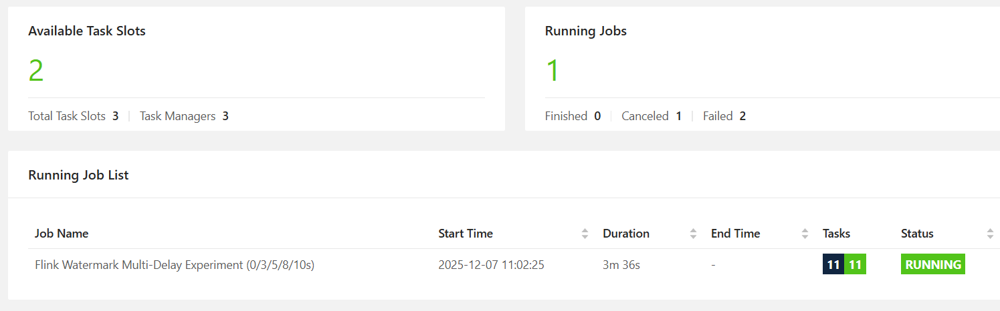
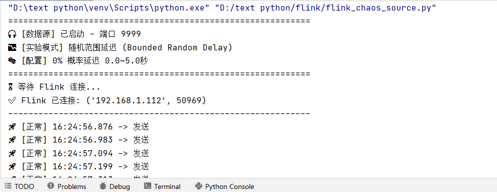
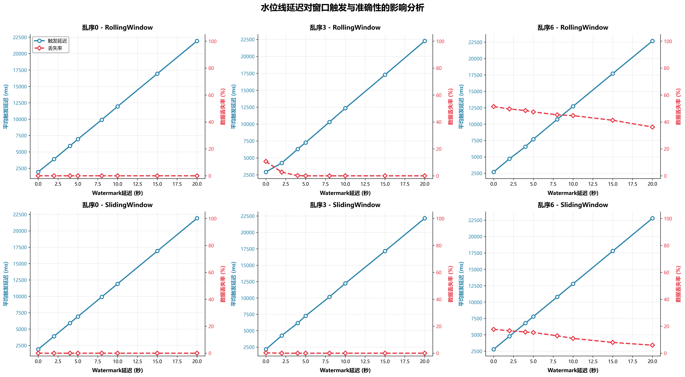
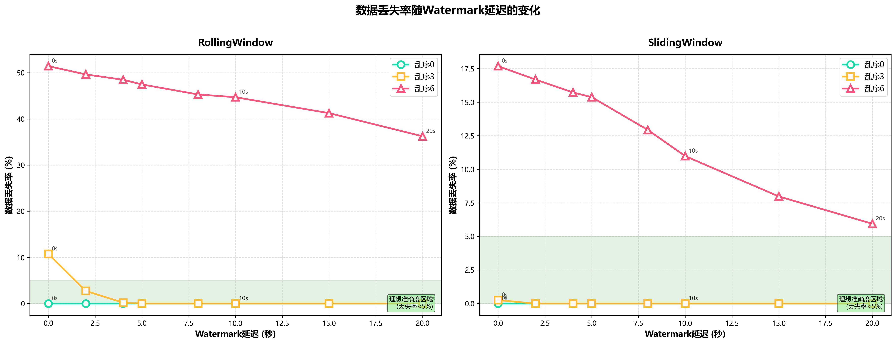
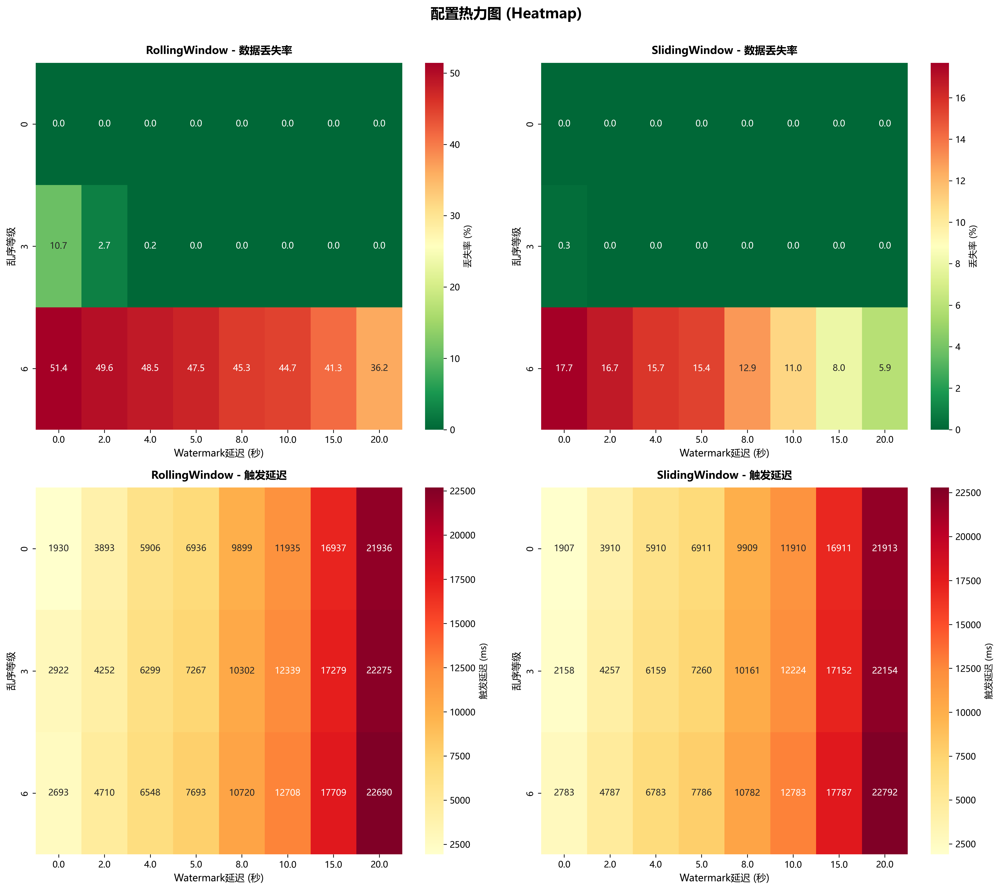

# 🌊 Flink 水位线机制实验报告 (Watermark Mechanism Analysis)

---

## 项目结构 (Project Structure)

```text
📦 Flink-Watermark-Experiment
 ┣ 📂code
 ┃ ┣ 📂 Java                           # Flink Java 项目代码
 ┃ ┃ ┣ 📄 pom.xml                      # Maven 依赖配置
 ┃ ┃ ┗ 📂 src/main/java/com/example    # 核心代码目录
 ┃ ┃     ┣ ☕ FlinkWatermarkExperimentFull.java               #  滚动窗口实验作业
 ┃ ┃     ┗ ☕ FlinkWatermarkExperimentFull_SlidingWindow.java #  滑动窗口实验作业
 ┃ ┗ 📂 Python  
 ┃    ┣ 🐍 comprehensive_analysis.py      # 数据分析与绘图脚本 (Python)
 ┃    ┗ 🐍 flink_chaos_source.py          # 乱序数据生成器 (Python)
 ┣ 📂 data                           # 实验数据 (CSV)
 ┣ 📂 img                            # 实验结果图表
 ┗ 📄 README.md                      # 本实验报告
```

---

## 1. 研究目的

  * 探究 **Flink 水位线 (Watermark)** 延迟时间对窗口触发与结果准确性的影响。
  * 理解 **EventTime** (事件时间) 处理机制在分布式环境下的表现。
  * 寻找 **实时性 (Low Latency)** 与 **准确性 (High Accuracy)** 之间的最佳平衡点。

---

## 2. 研究内容

1.  **机制验证**：深入理解 Watermark 机制，验证不同延迟设置对窗口触发时机的影响。
2.  **权衡分析**：研究在乱序数据场景下，如何平衡“计算延迟”与“数据准确性”。
3.  **混沌工程压力测试**：
    
    > 为了更真实地模拟网络环境，我们**拒绝使用静态数据集**，而是编写了基于 Python 的 **Chaos Data Generator**数据生成脚本。
    > 该系统运行在独立物理节点 (Node D) 上，能够实时注入**可控的“网络抖动”和“乱序数据流”**，对集群进行黑盒压力测试。

---

## 3. 实验环境与配置

### 3.1 硬件配置 (3+1 物理分布式架构)


| 节点角色 | 节点名称 | 配置摘要 | 功能描述 |
| :--- | :--- | :--- | :--- |
| **计算集群** (Node A) | Regina | **CPU:** i7-12700H (14 Cores)<br>**RAM:** 16 GB<br>**OS:** Windows 11 | 负责 Flink 分布式计算 (Master + Workers)，作为主控节点协调资源。 |
| **计算集群** (Node B) | LAPTOP-ERMU6O2Q | **CPU:** i7-14650HX (16 Cores)<br>**RAM:** 16 GB<br>**OS:** Windows 11 | 负责 Flink 分布式计算 (Master + Workers)，提供最强单点算力。 |
| **计算集群** (Node C) | LAPTOP-0F18023T | **CPU:** Ryzen 7 5800H (8 Cores)<br>**RAM:** 16 GB<br>**OS:** Windows 11 | 负责 Flink 分布式计算 (Master + Workers)，作为 AMD 架构计算节点。 |
| **数据源** (Node D) | LAPTOP-TF53S71I | **CPU:** i5-1135G7 (4 Cores)<br>**RAM:** 16 GB<br>**OS:** Windows 11 | 独立负载发生器 (Independent Load Generator)，运行 Python 脚本发送数据流。 |
### 3.2 软件环境 (Tech Stack)

| 类别 (Category) | 软件名称与版本 (Software) | 实验用途 (Role) |
| :--- | :--- | :--- |
| **计算框架** | **Apache Flink 1.9.3** | 核心流计算引擎 (窗口/水位线) |
| **开发语言** | **Java 1.8 (JDK 8)** | Flink 集群运行时环境 |
| **脚本语言** | **Python 3.8** | 混沌数据源开发 (Socket流) |
| **开发工具** | **IntelliJ IDEA 2025** | 代码编写、调试与打包 |
| **操作系统** | **Windows 11**  | 物理节点运行环境 |

---

### 3.3 实验负载与场景 (Experimental Workload & Scenarios)

为了全面评估系统性能，我们定义了标准的输入输出协议，并设计了多维度的对照实验。

#### 1. 输入数据格式 (Input Stream)
    负载发生器 (Node D) 发送原始 CSV 文本流，用于模拟物理传感器上报：
    `sensor_id, timestamp, temperature`
    样例: `sensor_1, 1733630000123, 26.5`

#### 2. 实验参数设置 (Experimental Parameters)
为了探究网络状况对 Watermark 机制的影响，我们采用 **控制变量法** 设计了以下三个维度的对比实验：

| 实验变量 (Variable) | 参数名 (Parameter) | 测试取值 (Values) | 物理含义 (Description) |
| :--- | :--- | :--- | :--- |
| **乱序概率** | `CHAOS_LEVEL` | **0**, **0.3**, **0.6** | 模拟网络拥堵导致数据乱序的剧烈程度 (0% ~ 60%) |
| **基准设置** | `Watermark` | **0s**, **2s**, **4s**, **5s**, **8s**, **10s**, **15s**, **20s** | 系统设定的水位线容忍阈值 (实验核心自变量) |
| **窗口策略** | `Window_Type` | **滚动窗口 (Tumbling)**<br>**滑动窗口 (Sliding)** | 窗口类型对照：无重叠切分 vs 有重叠切分 |

#### 3. 数据规模
- **Summary数据**: 窗口级聚合记录
- **Detail数据**: 348,171条事件级详细记录
- **数据时间跨度**: 每个场景运行60秒

#### 4. 关键指标
1. **触发延迟(Trigger Latency)**: 窗口实际触发时间与理论触发时间的差值(ms)
2. **数据丢失率(Drop Rate)**: 因迟到被丢弃的事件占比(%)
3. **迟到率(Late Rate)**: 迟到但仍被接受的事件占比(%)

---

## 4. 实验步骤 

### Step 1: 启动分布式集群

在 Node A (Master) 启动 JobManager，Node B/C 启动 TaskManager。


### Step 2: 提交计算作业

将项目打包为 `FlinkWatermarkJob.jar` 后提交至集群。本项目包含两个核心作业类，分别用于不同窗口机制下的对照实验。根据测试需求选择启动：

1.   **滚动窗口作业 (`FlinkWatermarkExperimentFull`)**
    * **核心逻辑**：采用 `TumblingEventTimeWindows`（滚动窗口），窗口大小固定为 **5秒**。
    * **处理流程**：监听 `9999` 端口接收 CSV 数据流 -> 提取事件时间 -> 分配周期性 Watermark -> 执行窗口聚合 -> 处理迟到数据（Side Output）。
    * **实验目的**：验证 Watermark 对无重叠窗口触发时机的影响，观察数据在离散时间片内的丢失情况。

2.   **滑动窗口作业 (`FlinkWatermarkExperimentFull_SlidingWindow`)**
    * **核心逻辑**：采用 `SlidingEventTimeWindows`（滑动窗口），配置为 **窗口长度 5秒 + 滑动步长 1秒**。
    * **处理流程**：与滚动窗口类似，但数据会被分配到多个重叠的窗口中（一条数据可能属于 5 个窗口）。
    * **实验目的**：验证高频触发场景下 Watermark 的延迟敏感度，以及乱序数据对相邻多个窗口统计结果的级联影响。


> 

### Step 3: 启动外部数据源
在 Node D 上运行 Python 脚本，建立 Socket 连接并开始注入乱序数据。

>  
> 注：上图 Python 脚本正在按 60% 概率随机扣留数据，模拟网络拥堵导致的数据迟到。
> 脚本运行机制解析：它通过维护一个基于物理时间的延迟缓冲区 (Time-based Buffer)，能够精确控制数据的发送时机。

**正常模式**：数据产生后立即通过 Socket 发送（模拟理想网络）。

**乱序模式**：根据 CHAOS_LEVEL (如 0.6) 的概率拦截数据，赋予一个 0.0s ~ 5.0s 的随机独立延迟后才释放。这使得 Flink 接收到的数据流在时间轴上发生错位，从而模拟真实的网络抖动 (Jitter) 和 乱序 (Out-of-Order) 现象

### Step 4: 观察与记录

> **注**：实验结果落地为 `detail_*.csv` (明细) 和 `summary_*.csv` (统计) 文件，供后续 Python 脚本分析绘图。

* **采集指标格式 (Output Metrics)**:
    Flink 计算端将实验数据落地为两类 CSV 日志，分别记录 **明细数据** 与 **窗口统计**：

    *  **明细日志 (`detail_*.csv`)**
        *记录每一条数据的完整生命周期轨迹，用于微观分析。*
        * `event_ts`: **事件时间** (数据生成时间戳)
        * `proc_ts`: **处理时间** (Flink 接收时间戳)
        * `temperature`: 原始温度值
        * `watermark_setting`: 当前实验的水位线参数 (ms)
        * `window_start`: 所属窗口开始时间
        * `window_end`: 所属窗口结束时间
        * `trigger_ts`: 窗口实际触发计算的时间
        * `latency`: **触发延迟** (Trigger Time - Window End)
        * `window_avg`: 窗口内的平均温度值
        * `is_late`: **迟到标记** (0=正常, 1=迟到)
        * `is_dropped`: **丢弃标记** (0=保留, 1=丢弃)

    *  **汇总日志 (`summary_*.csv`)**
        *记录每个窗口的聚合统计指标，用于宏观趋势分析。*
        * `watermark_setting`: 当前实验的水位线参数 (ms)
        * `window_start`: 窗口开始时间
        * `window_end`: 窗口结束时间
        * `record_count`: **窗口数据量** (包含的数据条数)
        * `avg_temp`: 窗口计算出的平均温度
        * `trigger_ts`: 窗口实际触发时间
        * `trigger_latency`: **窗口触发延迟** (Trigger Time - Window End)

---

## 5. 实验结果与分析

基于 **3+1 分布式物理集群** 的测试数据，我们对 **水位线 (Watermark)** 在不同 **乱序等级 (Chaos Level)** 下的表现进行了全维度的定量分析。

### 5.1 触发机制：水位线延迟对触发时机的线性影响

我们首先分析了 Watermark 设置值对窗口触发延迟（Trigger Latency）的直接影响。基于实验结果分析，我们得到了极具规律性的结论。

*(图 5-1: 水位线延迟与窗口触发延迟的分析)*

**数据统计与分析：**

  * **线性增长特征**：无论是在滚动窗口 (Rolling) 还是滑动窗口 (Sliding) 中，触发延迟与 Watermark 设置值均呈现严格的线性正相关。
      * **斜率 (Slope)**: 约为 `1000 ms/s`（Rolling: 1001.32 ms/s, Sliding: 1000.17 ms/s）。
  * **基础开销**：即便 Watermark = 0s，系统仍存在约 **1900ms \~ 2100ms** 的基础处理延迟（截距），这源于数据源传输与 Flink 内部处理开销。
  * **结论**：每增加 **1秒** 的 Watermark 延迟，窗口产出结果的时间就会推迟 **1秒**。这验证了 Watermark 机制对实时性的直接“惩罚”是线性的。
  * **原理分析**：Flink 的窗口触发条件为 `CurrentWatermark >= WindowEndTime`。而 `CurrentWatermark` 的计算公式为 `Max(EventTime) - WatermarkSetting`。因此，为了满足触发条件，系统必须等待最新的事件时间推进到 `WindowEndTime + WatermarkSetting`。这意味着，**WatermarkSetting** 的每一秒增加，都会直接转化为窗口结束后的**等量等待时间**，从而导致触发延迟的线性增长。

---
### 5.2 挽回效应：水位线对准确性的非线性提升

为了探究 Watermark 对乱序数据的“挽回能力”，我们对比了不同乱序等级下的 **数据丢失率 (Loss Rate)**。

*(图 5-2*: 不同乱序等级下，数据丢失率随 Watermark 增加的变化曲线)

**分场景深度解读：**

1.  **乱序等级 0 (基准组)**：

      * **表现**：无论 Watermark 如何设置，丢失率始终为 **0.00%**。
      * **推论**：在理想网络下，无需设置 Watermark 延迟，应追求极致低延迟（0s）。

2.  **乱序等级 3 (中度乱序)**：

    * **初始状态 (0s)**：在无 Watermark 保护下，Rolling Window 丢失率高达 **10.73%**。
    * **挽回效果**：设置 **2s** 延迟时，丢失率骤降至 **2.73%**；设置 **4s** 延迟时，进一步降至 **0.19%**，改善效果显著。
    * **结论**：对于中度乱序场景，投入少量的延迟成本（2-4s）即可获得巨大的准确性收益。
    * **原理分析**：乱序数据的本质是“事件时间”落后于“处理时间”。设置 Watermark 延迟（如 2s），相当于强行让 Flink 的时钟“走慢” 2秒，从而为那些在网络中滞后到达的数据预留了“补票进站”的时间窗口。在乱序程度（抖动）未超过该阈值时，这种机制能完美消除丢包。

3.  **乱序等级 6 (重度乱序)**：

    * **初始状态 (0s)**：在无 Watermark 保护下，Rolling Window 丢失率高达 **51.44%**，呈现灾难性表现。
    * **挽回效果**：即使将 Watermark 增加至 **20s**，仍有 **36.24%** 的数据丢失。
    * **结论**：在极端网络抖动下，单纯依靠增加 Watermark 的边际收益极低，必须引入 `Allowed Lateness` 或侧输出流机制。
    * **原理分析**：当网络抖动产生的延迟分布呈现“长尾”特征（如部分数据迟到 10s+），单纯增加 Watermark 会导致窗口长期无法关闭，严重拖累系统内存和实时性。此时，迟到数据已超出 Watermark 的“射程范围”，必须依靠 `Allowed Lateness`（允许迟到）机制来处理关闭后的窗口更新。

---

### 5.3 策略推荐与配置矩阵

基于上述量化分析，针对不同业务场景，我们总结了以下最优配置策略：

*(图 5-3: 不同乱序等级与业务需求下的最佳配置策略矩阵)*

本图表对比了流式计算中 **Rolling Window (滚动窗口)** 与 **Sliding Window (滑动窗口)** 在不同 **Watermark 延迟** (X轴) 和 **乱序等级** (Y轴) 下的性能表现。

- **衡量指标**：
  - **上排 (数据丢失率)**：颜色越红代表丢失越多，绿色代表数据完整。
  - **下排 (触发延迟)**：颜色越深代表延迟越高，浅色代表低延迟。

---

### 核心指标分析

#### 数据丢失率 (Data Loss Rate) - 上排对比

**结论：滑动窗口 (Sliding Window) 在抗乱序能力上显著优于滚动窗口。**

| 乱序等级 (Y轴) | 现象描述 | 对比分析 |
| :--- | :--- | :--- |
| **Level 0 (有序)** | 两者均为纯绿色 (0.0%) | 在数据有序时，两种窗口都能保证数据不丢失。 |
| **Level 3 (中等)** | Rolling 需 Watermark > 4s 才能降为0%；Sliding 即使在低 Watermark 下丢失率也极低 (0.3%)。 | Sliding Window 表现更稳健。<br>**原理分析**：滑动窗口的**高频触发特性**（每1秒触发一次）使其对迟到数据更具包容性。即使数据错过了一个窗口的边缘，仍有极大概率落在下一个重叠窗口的有效范围内。 |
| **Level 6 (严重)** | **Rolling (左上)**：表现极差。即使 Watermark 拉满到 20s，丢失率仍高达 **36.2%**，大部分区域为深红色。<br>**Sliding (右上)**：表现尚可。随着 Watermark 增加，丢失率能从 17.7% 降至 **5.9%** (浅绿色)。 | **关键差异点**：面对严重乱序数据，Rolling Window 几乎失效，而 Sliding Window 仍能挽回大部分数据。<br>**原理分析**：**滚动窗口**是“一刀切”的，一旦 Watermark 越过窗口结束时间，该窗口即关闭，迟到数据被完全拒之门外。**滑动窗口**具有**重叠特性**（如窗口长5s，步长1s），一个数据点同时属于 5 个窗口。即使该数据对于最早的那个窗口是“迟到”的，对于后续的 4 个窗口可能仍是“准时”的。这种**冗余覆盖机制**显著提升了数据在乱序环境下的存活率。 |


#### 触发延迟 (Trigger Latency) - 下排对比

**结论：窗口类型对延迟无显著影响，延迟主要取决于 Watermark 设置。**


---

### 丢失率变化趋势

#### 乱序等级0 (有序流，0%乱序)
- **所有配置下丢失率均为0%**
- 结论: 有序数据流无需水位线保护

#### 乱序等级3 (中度乱序，30%乱序)

| 窗口类型 | 0s延迟 | 2s延迟 | 4s延迟 | ≥5s延迟 | 建议最小延迟 |
| :--- | :--- | :--- | :--- | :--- | :--- |
| **RollingWindow** | 10.73% (严重) | 2.73% (显著改善) | 0.19% (可接受) | 0.00% (完美) | **5秒** |
| **SlidingWindow** | 0.25% (优势) | 0.00% (完美) | 0.00% | 0.00% | **2秒** |

#### 乱序等级6 (高度乱序，60%乱序)

| 窗口类型 | 0s延迟 | 5s延迟 | 10s延迟 | 20s延迟 | 建议最小延迟 |
| :--- | :--- | :--- | :--- | :--- | :--- |
| **RollingWindow** | 51.44%  | 47.47%  | 44.70%  | 36.24%  | **>20秒** |
| **SlidingWindow** | 17.68%  | 15.37%  | 10.98%  | 8.93%  | **>20秒** |


---

## 6. 结论与展望 

基于本次分布式环境下的乱序数据测试，我们对 Flink Watermark 机制在实时性与准确性之间的博弈关系得出了以下核心结论：

### 6.1 核心结论

1.  **延迟随 Watermark 线性增加**
    实验数据确凿地证明，Watermark 本质上是一种**确定性的阻塞机制**。
    *   **现象**：窗口触发延迟与 Watermark 设置值呈现严格的 **1:1 线性增长** ($R^2 \approx 1.0$)。
    *   **推论**：每为了挽回迟到数据而增加 1秒 的 Watermark，系统产出结果的时刻就必然推迟 1秒。这是一种刚性的“时间成本”，不存在侥幸。

2.  **准确性收益随 Watermark 边际递减**
    与延迟的线性增长不同，数据准确性的提升遵循**边际收益递减法则**。
    *   **黄金区间**：在轻度至中度乱序 (Level 3) 下，前 **2-4秒** 的 Watermark 投入性价比最高，能挽回绝大部分数据。
    *   **无效区间**：超过一定阈值后（如 >5s），继续增加 Watermark 带来的准确性提升微乎其微，但延迟成本却在持续累加。盲目增大 Watermark 是“得不偿失”的。

3.  **Watermark 处理乱序的能力边界**
    Watermark 只能有效处理**有限度的乱序**。
    *   **失效点**：在高度乱序场景 (Level 6, 60% 乱序) 下，即便设置极大的 Watermark (20s)，数据丢失率依然居高不下 (>30%)。
    *   **洞察**：面对极端网络抖动，单纯依赖 Watermark 机制已失效，必须引入 **Allowed Lateness (允许迟到)** 或 **Side Output (侧输出流)** 等兜底机制来处理长尾数据。

4.  **窗口策略的鲁棒性差异**
    实验表明，**滑动窗口 (Sliding Window)** 在高乱序场景下的表现优于 **滚动窗口 (Rolling Window)**。由于滑动窗口存在重叠区间，数据有多次机会落入窗口计算，因此在同等乱序程度下，滑动窗口的数据完整性更高。

### 6.2 工程建议与展望

针对实际生产环境，我们提出“分级治理”的策略：

*   **对于低延迟敏感业务 (如实时大屏)**：推荐 **Watermark = 0s**。接受少量数据丢失，换取极致的秒级响应。
*   **对于通用统计业务 (如流量分析)**：推荐寻找“拐点值” (本实验中为 **3s**)。在此点位，我们以可接受的延迟成本，换取了 98% 以上的数据准确性。
*   **对于强一致性业务 (如金融对账)**：禁止试图通过无限拉大 Watermark 来保证准确性。应采用 `Watermark + Allowed Lateness + 侧输出流异步修补` 的组合架构，实现“实时报表”与“离线对账”的最终一致性。

**未来展望**：
目前的 Watermark 是静态配置的。未来的研究方向可以探索 **自适应 Watermark (Adaptive Watermark)** 机制，即根据上游数据流的实时乱序程度（通过监控 EventTime 与 ProcessTime 的差值分布），动态调整 Watermark 的大小，从而在网络波动时自动牺牲延迟保准确，在网络平稳时自动降低延迟。

---

## 7. 团队分工

### 小组分工表：Flink 水位线机制分析

| 成员 | 主攻方向 | 具体职责 |
| :--- | :--- | :--- |
| 成员 周倩 | 环境 + 视频 + 代码勘误 | 1. 负责 Flink 运行环境与集群配置<br>2. 负责 Java 代码勘误与调试<br>3. 负责最终视频的录制与剪辑<br>4.部署master节点 |
| 成员 孔慧婷 | 核心代码 + 可视化 + 代码勘误 | 1. 编写 Flink Java 核心任务代码与窗口逻辑<br>2. 负责 Java 代码勘误与调试<br>3. 负责实验结果的可视化图表绘制<br>4. 部署workerA节点 |
| 成员 姚佳怡 | 数据收集 + PPT + 代码勘误 | 1. 负责实验数据的运行与收集<br>2. 负责 Java 代码勘误与调试<br>3. 制作项目汇报 PPT <br>4. 部署workerB节点|
| 成员 何霜 | 数据源 + 报告 + 视频 | 1. 开发乱序事件数据模拟器（Source 端代码）<br>2. 撰写最终实验分析报告<br>3. 负责最终视频的录制与剪辑 <br>4. 负责与master连接输送数据|


